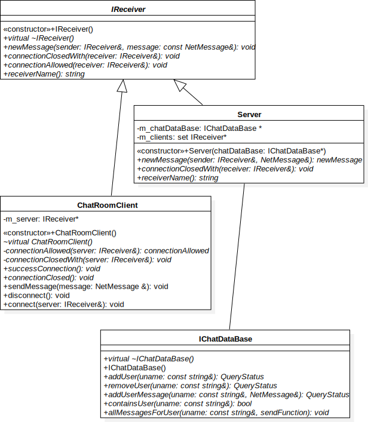

# ChatRoom

### Логика работы программы

Для симуляции хранения сообщений и подключения к серверу 
реализованы классы ChatDataBase : IChatDataBase и LocalNetConnector.

В данной релизации IReceiver'ы работают напрямую через память,
в сетевой версии реализации интерфейса IReceiver
должы работать с сетью

<tokmakou@gmail.com>
